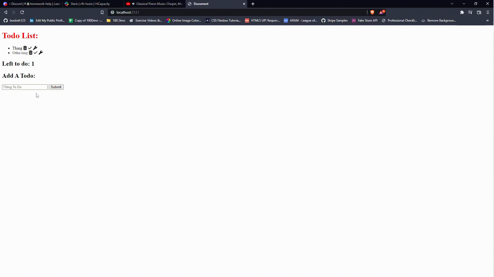

## Description
A full stack web application that posts & stores to-do tasks. You may mark a task as completed, delete a task entirely, or mark completed tasks as uncomplete.

The (UPDATED) project is deployed here: https://salty-castle-61426.herokuapp.com/

## Demo

## Features
* Executes POST, GET, PUT, and DELETE operations.
* Displays variable data using (EJS) Embedded JavaScript.

## Technologies

## Optimizations
* I want to add be able to edit task text.
