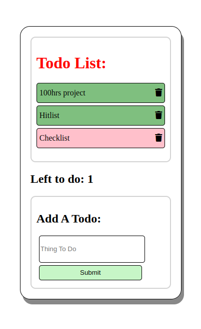

### TODO List generator

### Description :
This is a simple to do list generator and manager. Create new ones, mark items as completed and delete old ones.

### Link to project: https://to-do-list-new-beta.herokuapp.com/

### How It's Made:
Tech used: Node.js,Express.js,Mongodb;

### How to use: 
npm install  
add DB_STRING to .env file

### Optimizations
The UI could be extended to include frameworks.

### Lessons Learned:
Used template files this time instead of going for seperate front end.
